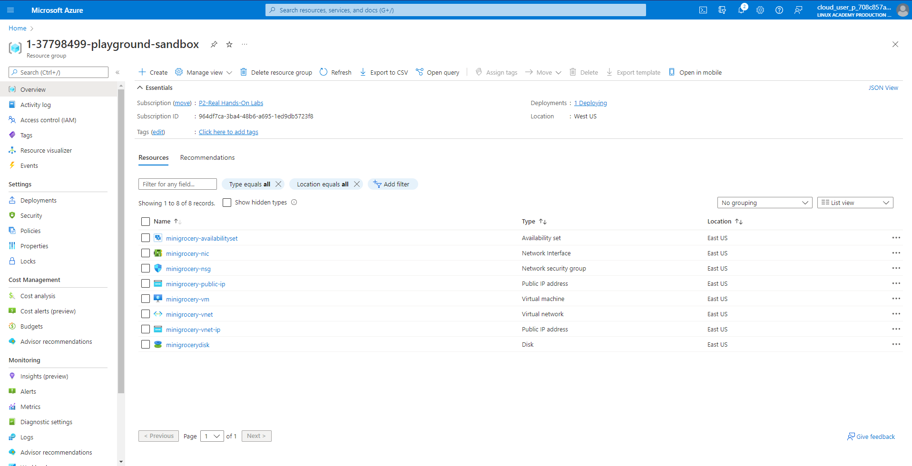
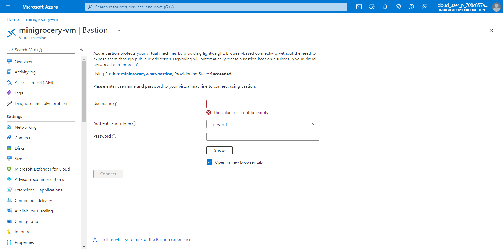
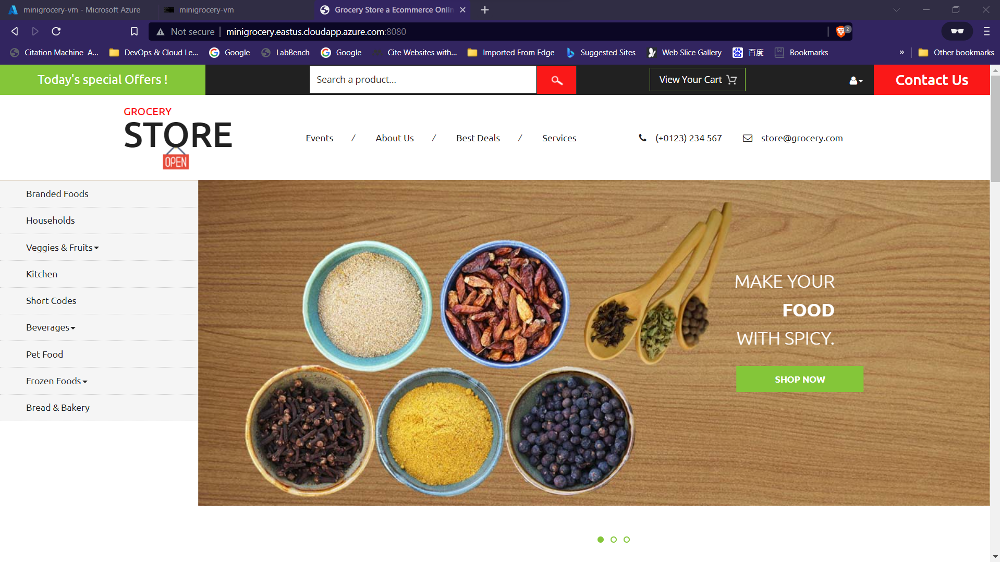

# SOCE Technical Test 2022 #

### This test is using Terraform (IaC) and docker to provision and set up a website in dokerfile using Cloud Virtual Machine
## Tools that require before we started: :white_check_mark:

* Linux Kernel (Ubuntu20.04),
* Azure Sandbox / Azure 
* Azure CLI
* [Terraform](https://cloudlinuxtech.com/install-terraform-on-ubuntu-uninstall-terraform/)
* [sshpass](https://installati.one/ubuntu/20.04/sshpass/)
* git
* [vim](https://www.cyberciti.biz/faq/howto-install-vim-on-ubuntu-linux/)

### Step To Follow: 

1. Clone the file from this git repository to your Local Machine.
2. Start your Azure Sandbox (with existing resources group) or login to your Azure Account and create your own resources group.
3. Change the resources group name of your Azure account in variable.tf 
    > variable "resource_group_name" 
    >> default = "<your_resources_group_name>"
4. You can change the virtual machine Username and Password in variable.tf 
    > variable "admin_user"
    >> default = "<your_admin_user_name>"
    
    > variable "admin_password" 
    >> default = "<your_admin_password>"
5. Login to Azure Account ```az login -u <you_account_name>```
6. Use Terraform to set up the resources with `main.tf`, `variable.tf` & `output.tf` with the following comment: 
   * `terraform init`
   * `sudo bash -c "sed -i '/management.azure.com/d' /etc/hosts" ; sudo bash -c 'echo  "$(dig management.azure.com | grep -E -o "([0-9]{1,3}[\.]){3}[0-9]{1,3}$") management.azure.com" >> /etc/hosts'`
   * `terraform plan`
   * `terraform apply -auto-approve`
7. After complete `terraform apply -auto-approve`, wait for 1-2 minute and press Refresh button to check the resources that add to Azure resources group.
<p align="center">
  

8. Create Azure Bastion (Bastian Subnet will be create automatically) and login to access the Linux Virtual Machine with the admin_user and admin_password that input in variable.tf.
<p align="center">
  

9. Install [Docker](https://www.digitalocean.com/community/tutorials/how-to-install-and-use-docker-on-ubuntu-20-04) in the virtual machine and check the docker version with `docker --version` 

10. git clone the repository from my [github repository - RickPoh95/webcreation](https://github.com/RickPoh95/webcreation) for the Dockerfile and web folder.

11. `Change the directory to webcreation folder` and Build the docker images with the following command:
```
sudo docker build -t groceryweb/test:v1 .
```

12. Check the docker images with `sudo docker images` and create the volume in the following command: 
```
sudo mkdir -p /var/lib/docker/apacheweb
```

13. Build the docker container with the following command:
```
sudo docker run -dit --name groceryweb -p 8080:80 -v /var/lib/docker/apacheweb:/mnt groceryweb/test:v1
```

14. Open the Mini Grocery Webpage using the `public ip_address` or `DNS` in virtual machine (after the resources appear in Azure resources group) with the port of 8080, `take note that the connection is not secure and require to access the link by clicking advances setting`
<p align="center">
  


15. Delete all the resources in resources group by using the terraform comment:
    * `terraform destroy -auto-approve`

### Reference

* [Terraform Azurerm](https://registry.terraform.io/providers/hashicorp/azurerm/latest/docs/resources/network_security_group)
* [Terraform Local - Create local file](https://registry.terraform.io/providers/hashicorp/local/latest/docs/resources/file)
* [azure-bastion](https://registry.terraform.io/modules/kumarvna/azure-bastion/azurerm/latest)
* [Docker Hub - httpd](https://hub.docker.com/_/httpd)
* [Grocery Store – Ecommerce Category Flat Bootstrap Responsive Website Template](https://w3layouts.com/template/grocery-store-ecommerce-online-shopping-category-flat-bootstrap-responsive-web-template/)

### Area To improve
* Include SSL in the webpage.


### Note

* Terraform code was reference from the json code (in ExportedTemplate-1-e2a75474-playground-sandbox folder) that exported from Azure Platform
* The webpage is downloaded from [Grocery Store – Ecommerce Category Flat Bootstrap Responsive Website Template](https://w3layouts.com/template/grocery-store-ecommerce-online-shopping-category-flat-bootstrap-responsive-web-template/)


    


